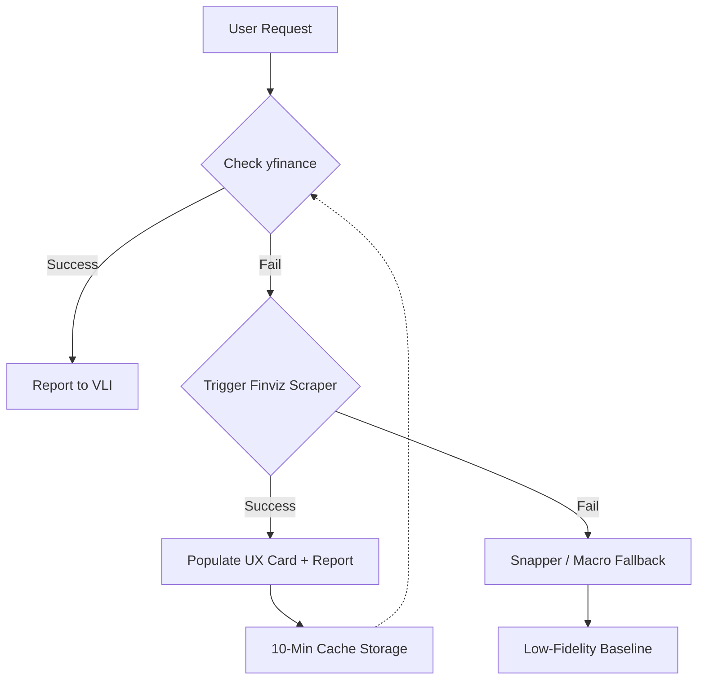

# Core Architecture: CMA (Cobalt Multiagent)

Project Cobalt follows a specialized multi-agent architecture designed to maintain high data fidelity and prevent AI hallucination in financial analysis.

## Agent Role Specialization

The system is partitioned into distinct roles, each with strict boundaries and toolsets.

### 1. The Scout (The IO Hub)
- **Role**: Specialized in raw data retrieval and brokerage integration.
- **Capabilities**: 
    - Fetches brokerage accounts, history, balances, and statements via SnapTrade.
    - Operates as the **exclusive primary hub** for external internet data (Search, Crawl, Snapper).
- **Philosophy**: "Get the data, don't ask questions." Scout does not perform synthesis or logic consolidation.

### 2. The Analyst (The Math Engine)
- **Role**: A high-precision logic engine focused on technical market indicators.
- **Terminology**: **Getting** (Internal). The Analyst "gets" data from the internal database or shared storage.
- **Capabilities**:
    - Executes Smart Money Concepts (SMC) analysis: BOS, CHoCH, FVG, MSS.
    - Calculates technical indicators: EMA, RSI, MACD, Volatility (ATR), Volume Profile, Bollinger Bands.
- **Data Routing**: Operates strictly on **Internal Data**. It is restricted from the external internet. If the required market data or metrics are missing from the internal database/shared storage, the Analyst request MUST fail.
- **Philosophy**: "Zero Filler." The Analyst provides strictly formatted Markdown tables with high mathematical certainty.

### 3. The Researcher (The Synthesis Engine)
- **Role**: A specialized extension of the Analyst that integrates external research.
- **Terminology**: **Fetching** (External). The Researcher "fetches" or "scouts" up-to-date data from the external internet.
- **Capabilities**:
    - Inherits all technical indicator capabilities from the Analyst.
    - Accesses Scout primitives to fetch and synthesize up-to-date web information (news feeds, sentiment, macro reports).
- **Philosophy**: "Contextual Synthesis." The Researcher provides the "Why" behind the "What," bridging the gap between technical charts and real-world events.

### 4. Orchestrator (Parser & Coordinator)
- **Role**: The cognitive planning layer (VibeLink Interface).
- **Bypass Logic**: For trivial requests (e.g., "What's the price of BTC?"), the Orchestrator can call Scout primitives directly for a **Fast Bypass**, skipping multi-node journeys for instant fulfillment.

## State Isolation (The 3-Tier Model)

Each node operates under a strict isolation standard to prevent state leakage:
1. **Node Private Context**: Transient state specific to a single execution.
2. **Shared Resource Context**: Persistent state shared by agents of the same type (e.g., historical Analyst findings).
3. **Global Resource Context**: Immutable configuration and global system state.

## 4. The Fallback Resonance Pipeline

Project Cobalt implements a multi-stage fallback strategy to ensure data reliability and visual proof of work during market volatility or primary API outages.

### Data Retrieval Hierarchy

### High-Fidelity UX Synchronization
- **UX Card Directive**: When a fallback is triggered, the **Scout** captures a base64 screenshot and normalized tile coordinates.
- **Dynamic Resonance**: The VLI Dashboard renders a target highlight rectangle and pulse animations based on this telemetry, providing the user with "Visual Proof of Work."

## 5. Data Pipeline Flow

1. **Orchestrator** receives a "vibe" (user input).
2. **Scout** retrieves the raw data (Brokerage or Web).
3. **Researcher** or **Analyst** processes the raw data into technical or fundamental findings.
4. **Reporter** (VLI) delivers the final dispatch to the Hub (Obsidian).
