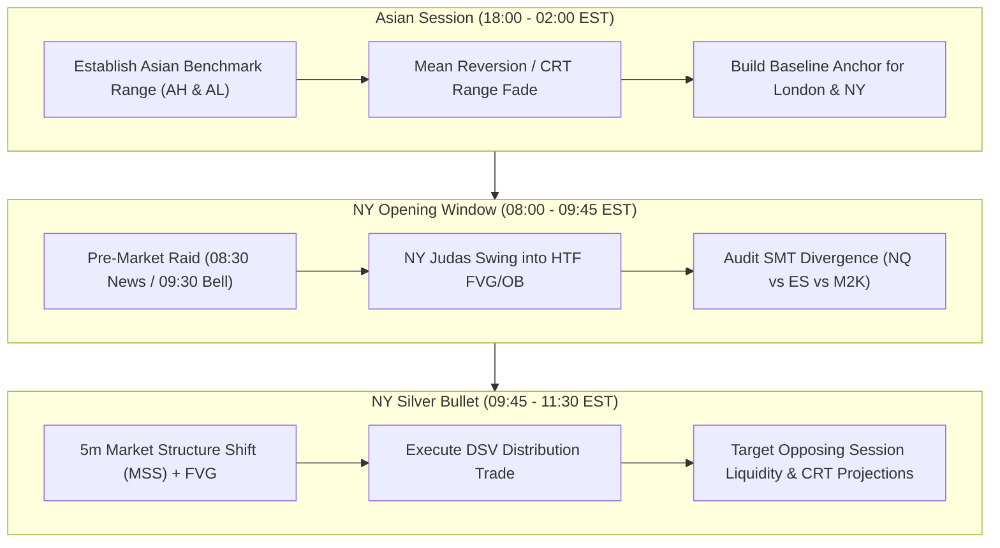

# Dual-Session Vector (DSV) Strategy Playbook

## 1. System Overview & Philosophy

The **Dual-Session Vector (DSV)** system is an institutional futures trading strategy built around **Accumulation, Manipulation, Distribution (AMD)** and **Candle Range Theory (CRT)**. It exploits directional price expansion across your active trading windows: **Asian Session (18:00–02:00 EST)** and **New York Session (08:00–17:00 EST)**.

---

## 2. Risk Engine & Execution Architecture

### 2.1 Multi-Account Copy Trade Matrix
* **Strategy Name**: Dual-Session Vector (DSV)
* **Account Setup**: 5 Funded Prop Accounts via Trade Copier (Master $\rightarrow$ 4 Slaves).
* **Fixed Risk per Trade**: **$50.00 per account** ($250.00 total across 5 accounts).
* **Fixed Target per Trade (2:1 R:R)**: **$100.00 per account** ($500.00 total across 5 accounts).
* **Breakeven Win Rate Required**: **33.3%** $\left(\frac{\$50}{\$50 + \$100}\right)$. 

#### DSV Sizing Table ($50 Risk / 2:1 Target)

| Asset Symbol | Position Size | Stop Loss Distance ($50 Risk) | Take Profit Distance ($100 Target) | Notes / Execution Guidelines |
| :--- | :--- | :--- | :--- | :--- |
| **MNQ** (Micro NQ) | **1 Contract** | **25 Ticks (6.25 pts)** | **50 Ticks (12.50 pts)** | Best for tight 5m FVG / 3m CRT entry wicks. |
| **MNQ** (Micro NQ) | **2 Contracts** | **12.5 Ticks (3.125 pts)** | **25 Ticks (6.25 pts)** | Best for high-precision 1m Silver Bullet entries. |
| **MES** (Micro ES) | **1 Contract** | **40 Ticks (10.00 pts)** | **80 Ticks (20.00 pts)** | Excellent for steady NY session trends. |
| **MES** (Micro ES) | **2 Contracts** | **20 Ticks (5.00 pts)** | **40 Ticks (10.00 pts)** | Standard ES manipulation sweep entry. |
| **M2K** (Micro Russell)| **1 Contract** | **100 Ticks (10.00 pts)** | **200 Ticks (20.00 pts)** | Ideal for wider session range plays. |

> [!IMPORTANT]
> **Execution Constraint**: Always use **Limit Orders** on the Master Account to ensure all 5 copy-traded slave accounts receive identical fills without slippage drag.

---

## 3. Session AMD Architecture

---

## 4. DSV Rules (Building Phase)

*(We will build out your specific entry, management, and session rules one by one.)*

* **Rule #1 (Risk & Sizing)**: Fixed $50 Risk / $100 Profit Target (2:1 R:R) per trade across 5 copy-traded accounts. Limit order entry required.
