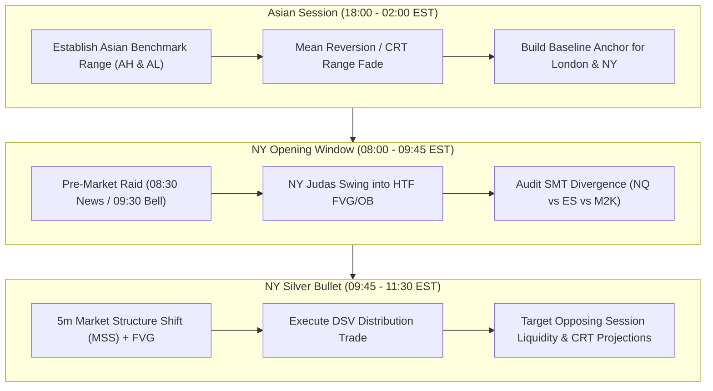

# Dual-Session Vector (DSV) Strategy Playbook

## 1. System Overview & Philosophy

The **Dual-Session Vector (DSV)** system is an institutional futures trading strategy built around **Power of 3 (Po3 - Accumulation, Manipulation, Distribution)** and **Candle Range Theory (CRT)**. It exploits directional price expansion across your active trading windows: **Asian Session (18:00–02:00 EST)** and **New York Session (08:00–17:00 EST)**.

---

## 2. Risk Engine & Execution Architecture

### 2.1 Multi-Account Copy Trade & Position Sizing Matrix

* **Strategy Name**: Dual-Session Vector (DSV)
* **Account Setup**: 5 Funded Prop Accounts via Trade Copier (Master $\rightarrow$ 4 Slaves).
* **Fixed Risk per Trade (1R)**: **$50.00 per account** ($250.00 portfolio risk).
* **Fixed Target per Trade (2R)**: **$100.00 per account** ($500.00 portfolio target).
* **Weekly Profit Target (30R)**: **30R per account / week = $1,500.00 per account** ($7,500.00 weekly portfolio target).
* **Breakeven Win Rate Required**: **33.3%** $\left(\frac{\$50}{\$50 + \$100}\right)$. 

```
+-----------------------------------------------------------------------+
|                    DSV 30R WEEKLY TARGET MATRIX                       |
|                                                                       |
| 1R RISK PER TRADE       = $50.00 / account  ($250.00 portfolio)     |
| 2R TARGET PER TRADE     = $100.00 / account ($500.00 portfolio)     |
| 30R WEEKLY GOAL         = $1,500.00 / account ($7,500.00 portfolio)   |
| WEEKLY LOCK TRIGGER     = Reaching +30R locks trading for the week. |
+-----------------------------------------------------------------------+
```

#### DSV Sizing Table ($50 Risk / 2:1 Target)

| Asset Symbol | Position Size | Stop Loss Distance ($50 Risk = 1R) | Take Profit Distance ($100 Target = 2R) | Notes / Execution Guidelines |
| :--- | :--- | :--- | :--- | :--- |
| **MNQ** (Micro NQ) | **1 Contract** | **25 Ticks (6.25 pts)** | **50 Ticks (12.50 pts)** | Best for tight 5m FVG / 3m CRT entry wicks. |
| **MNQ** (Micro NQ) | **2 Contracts** | **12.5 Ticks (3.125 pts)** | **25 Ticks (6.25 pts)** | Best for high-precision 1m Silver Bullet entries. |
| **MES** (Micro ES) | **1 Contract** | **40 Ticks (10.00 pts)** | **80 Ticks (20.00 pts)** | Excellent for steady NY session trends. |
| **MES** (Micro ES) | **2 Contracts** | **20 Ticks (5.00 pts)** | **40 Ticks (10.00 pts)** | Standard ES manipulation sweep entry. |
| **M2K** (Micro Russell)| **1 Contract** | **100 Ticks (10.00 pts)** | **200 Ticks (20.00 pts)** | Ideal for wider session range plays. |

> [!IMPORTANT]
> **Weekly Goal Lock Rule**: Once an account hits **+30R ($1,500.00 P&L)** within the calendar week, execution is **LOCKED** for the remainder of that week to preserve gains and prevent profit clawbacks.

---

## 3. Session Po3 Architecture



---

## 5. Discipline & Execution Safeguards (The 3 Circuit Breakers)

To eliminate overtrading, revenge trading, and daily loss overshoots, the DSV strategy enforces **3 Hard Circuit Breakers**. These rules are binary and require zero subjective decision-making during active market hours.

```
+-----------------------------------------------------------------------+
|                    DSV 3-CIRCUIT-BREAKER DISCIPLINE MATRIX            |
|                                                                       |
| 1. MAX 2 TRADES PER SESSION   --> Lock session execution after 2 trades|
| 2. ONE-AND-DONE DIRECTION     --> Stop-out locks that direction for   |
|                                   the session. No revenge re-entries. |
| 3. HARD DAILY LOSS CAP (-$150)--> 3 Losses (-$150/acct) = Day Over.   |
+-----------------------------------------------------------------------+
```

### Circuit Breaker 1: Max 2 Trades Per Session
* **Rule**: You are allowed a maximum of **2 trades during the Asian Session** and **2 trades during the NY Session**.
* **Rationale**: Eliminates overtrading during low-probability chop. If your first 2 setups do not work, market conditions are not aligned with the DSV model.
* **Action**: Close trading software / step away until the next session window.

### Circuit Breaker 2: One-and-Done Direction Lock
* **Rule**: If a Long trade is stopped out, **you cannot take another Long trade in that same session**. If a Short trade is stopped out, **you cannot take another Short trade in that same session**.
* **Rationale**: Prevents tilt and the "re-entry loop" of repeatedly buying/selling into a runaway institutional trend.
* **Action**: You must either wait for a valid setup in the *opposite* direction or wait for the next session.

### Circuit Breaker 3: Hard Daily Loss Cap ($150 / 3 Total Losses)
* **Rule**: Fixed Risk = **$50.00** per trade per account.
  * 1 Loss = -$50.00
  * 2 Losses = -$100.00
  * 3 Losses = -$150.00 $\rightarrow$ **HARD DAY LOCK** (Portfolio Risk capped at -$750 total).
* **Rationale**: Protects prop account trailing drawdown. Stopping at 3 losses ensures your maximum single-day damage is easily recoverable in a single winning trade ($100 target * 2 = +$200).

---

## 7. Trading Log Data & Performance Optimization Engine

The DSV strategy integrates historical trade log analytics and account journaling directly from your **Brokerage Logs, TradeZella Exports, and Cobalt Backend Data**.

### 7.1 Historical Profile vs. DSV Target Alignment

| Metric | Historical Baseline Profile | DSV Optimized Target Engine | Performance Impact |
| :--- | :--- | :--- | :--- |
| **Payoff Ratio (Avg Win / Avg Loss)** | **1.38** (+$49.79 Win / -$36.17 Loss) | **2.00** ($100 Target / $50 Risk) | **+45% increase in payoff efficiency** |
| **Breakeven Win Rate Required** | **42.0%** | **33.3%** | Lower win rate burden; highly resilient to loss streaks |
| **Trade Frequency Control** | Uncapped (risk of overtrading) | Max 2 Trades/Session (Cap: 4 trades/day) | Eliminates fee friction & micro-scalp negative risk traps |
| **Session Isolation** | Combined | Segmented: Asia (Mean Reversion) vs NY (Expansion) | Precise entry rules tailored to session volatility |

## 8. TradingView Indicator Toolkit & Chart Layout Blueprint

To execute the DSV strategy cleanly without cognitive overload or analysis paralysis during fast market sweeps, we streamline your current 13 indicators down to **5 Core Tactical Tools**.

```
+-----------------------------------------------------------------------+
|                    DSV STREAMLINED TRADINGVIEW TOOLKIT                |
|                                                                       |
| 1. CRT MTF (Milana Trades / Custom) --> HTF Ranges & 50% Equilibrium  |
| 2. LuxAlgo Sessions                 --> Asia/London Bounds & 00:00 EST|
| 3. Cumulative Volume Delta (CVD)    --> Absorption vs Breakout Audit  |
| 4. Institutional Activity / LuxAlgo --> 5m MSS & Fair Value Gaps      |
| 5. VWAP                             --> Institutional Fair Value Benchmark|
+-----------------------------------------------------------------------+
```

### 8.1 Indicator Retention & Elimination Matrix

| Indicator | Status | DSV Strategic Role | Rationale for Change |
| :--- | :--- | :--- | :--- |
| **CRT MTF (Milana Trades)** | 🟢 **KEEP (Core)** | Defines Asian CRT boundaries & 50% EQ baseline | Essential for anchor range fading & expansion targets. |
| **LuxAlgo Sessions** | 🟢 **KEEP (Core)** | Draws Asian/London highs/lows + Midnight Open | Essential for London Judas & NY Silver Bullet targets. |
| **Cumulative Volume Delta (CVD)** | 🟢 **KEEP (Core)** | Institutional absorption vs breakout audit | Confirms if session sweep is a trap or true trend. |
| **Institutional Activity / LuxAlgo PA** | 🟢 **KEEP (Core)** | Identifies 5m MSS & Fair Value Gaps (FVG) | Precise entry trigger identification. |
| **VWAP** | 🟢 **KEEP (Core)** | Dynamic fair value benchmark | Confluence for Asian range fading at discount/premium. |
| **MACD** | 🔴 **REMOVE** | None | Lagging indicator; conflicts with SMT & FVG entries. |
| **Bollinger Bands (BB)** | 🔴 **REMOVE** | None | Redundant with CRT 50% EQ; clutters candle wicks. |
| **MA Ribbon** | 🔴 **REMOVE** | None | Distorts price action visibility during tight Asia channels. |
| **RSI & CMF** | 🟡 **OPTIONAL** | Secondary momentum check | CVD provides superior real-time orderflow delta. |

---

## 9. DSV Master Checklist

| Phase | Action Required | Tool / Indicator Used |
| :--- | :--- | :--- |
| **1. Pre-Market** | Mark Asian High/Low, Midnight Open, CRT 50% EQ | LuxAlgo Sessions + CRT MTF |
| **2. Manipulation** | Audit sweep of session extreme into HTF FVG | CVD Divergence + SMT Correlation |
| **3. Trigger** | Wait for 5m MSS + 5m FVG | Institutional Activity / LuxAlgo PA |
| **4. Execution** | Limit Order entry with $50 Risk / $100 Target | Master Trade Copier (5 Accounts) |
| **5. Discipline** | Enforce 3 Circuit Breakers (Max 2 trades/session) | Cobalt Backend Automated Watchdog |

