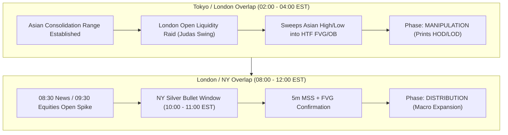

# Global Trading Session Overlaps & SMC Execution Guide

## Executive Summary

In global electronic futures and forex markets, trading volume and price volatility are not distributed evenly across 24 hours. Instead, liquidity concentrates around **Session Overlaps**—windows of time when institutional market participants across two major economic timezones are active simultaneously.

Understanding session overlaps allows futures traders to predict **when liquidity sweeps will occur** (Manipulation) and **when sustained trend momentum will expand** (Distribution).

---

## 1. Global Session Overlap Timeline

The diagram below illustrates the 24-hour cycle of the primary global trading centers (Asia-Pacific, London, and New York) along with their active overlap windows in **Eastern Standard Time (EST)**:

```mermaid
gantt
    title Global Trading Sessions & Overlaps (EST)
    dateFormat  HH:mm
    axisFormat %H:%M

    section Main Sessions
    Asian Session (Tokyo/HK/Sydney) :active, asia, 18:00, 8h
    London Session (Europe)          :active, london, 02:00, 6h
    New York Session (US)            :active, ny, 08:00, 9h

    section Major Overlaps
    Tokyo / London Overlap           :crit, overlap1, 02:00, 2h
    London / NY Overlap              :crit, overlap2, 08:00, 4h
```

---

## 2. Deep Dive: The Two Major Session Overlaps

### 🌐 1. London / New York Overlap (08:00 AM – 12:00 PM EST)
* **Status**: **Peak Daily Liquidity & Volatility (The "Power Hours")**
* **Time Window**: `08:00 EST – 12:00 EST` (13:00 – 17:00 GMT)
* **Institutional Context**:
  * London (Europe's capital hub) and New York (Americas' capital hub) are both fully operational.
  * Accounts for over **50% to 60% of total daily global volume** in index futures and foreign exchange.
* **Key Volatility Events**:
  * **08:30 EST**: High-Impact US Economic News Releases (CPI, NFP, PPI, GDP).
  * **09:30 EST**: US Equities Opening Bell (RTH Open).
  * **10:00 – 11:00 EST**: NY Morning Silver Bullet Execution Window.
* **Futures Impact**: Peak volume and fastest order execution on **ES**, **NQ**, **M2K**, **YM**, **GC** (Gold), and **CL** (Crude Oil).

---

### 🌏 2. Tokyo / London Overlap (02:00 AM – 04:00 AM EST)
* **Status**: **European Morning Expansion & Liquidity Raid**
* **Time Window**: `02:00 EST – 04:00 EST` (07:00 – 09:00 GMT)
* **Institutional Context**:
  * Asian markets (Tokyo/Hong Kong/Singapore) are conducting EOD positioning while European financial hubs (Frankfurt/London) open for their morning session.
* **Key Volatility Events**:
  * **02:00 EST**: Frankfurt Open / London Opening Bell.
  * **02:00 – 03:30 EST**: **The ICT London Judas Swing** (engineered sweep of Asian Range High/Low).
* **Futures Impact**: Excellent for early-bird futures traders targeting initial daily high/low sweeps into 1h/4h CRT key levels.

---

## 3. Session Overlap & SMC Strategy Matrix

---

## 4. Summary Reference Matrix

| Session Overlap | Window (EST) | Volume / Volatility | Primary Assets | SMC / AMD Operational Role |
| :--- | :--- | :--- | :--- | :--- |
| **Tokyo / London** | **02:00 – 04:00 EST** | Moderate $\rightarrow$ High | EUR/USD, GBP/USD, AUD/JPY, Gold | **Manipulation Sweep (Judas Swing)** of Asian Range High/Low |
| **London / New York** | **08:00 – 12:00 EST** | **Extremely High (Peak)** | ES, NQ, M2K, YM, CL, GC | **Macro Distribution / True Expansion** (NY Silver Bullet Entry) |
| *Asia / NY Gap* | *17:00 – 18:00 EST* | Illiquid / Globex Reset | All Futures / FX | Market Maintenance & Settlement Reset |

---

> [!TIP]
> **Pro Trading Rule**: High-probability SMC/CRT setups require both **Time & Price**. Look for structural setups (Sweeps / FVGs / SMT Divergence) that form specifically within the **Tokyo/London Overlap** (02:00–04:00 EST) or the **London/NY Overlap** (08:00–11:00 EST).
