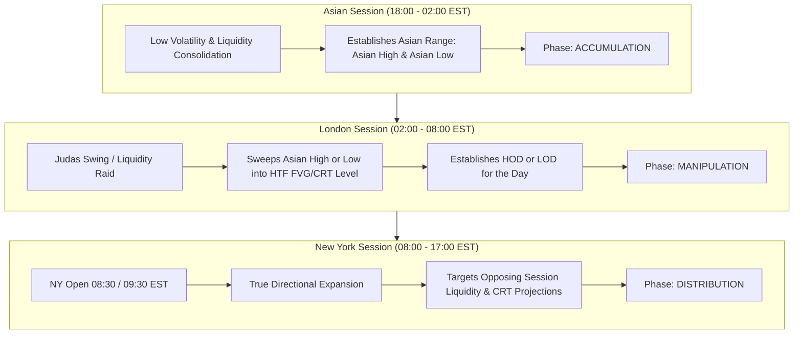
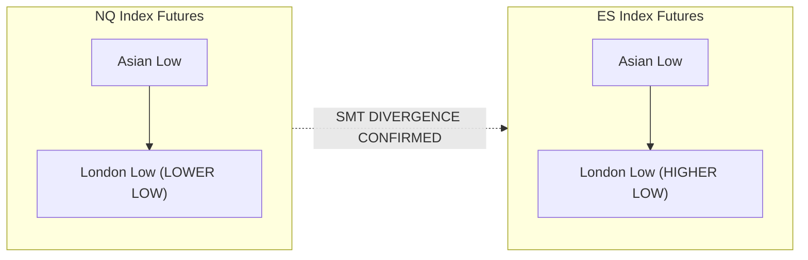
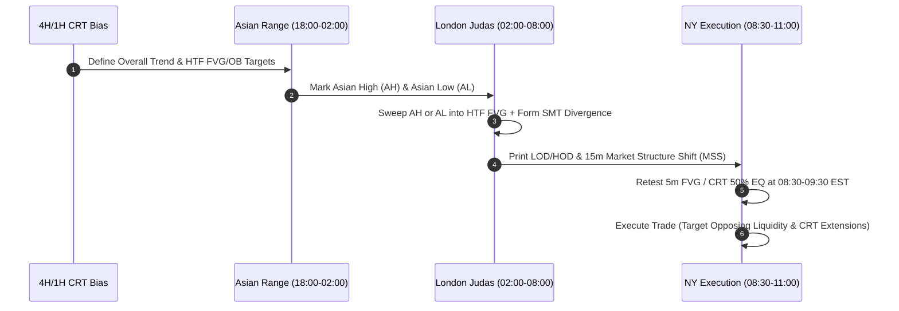

# Global Session Po3 Structure & SMC/CRT Correlation Playbook for Futures

## Executive Summary

In algorithmic futures markets (ES, NQ, M2K, YM), the 24-hour trading day is not a chaotic sequence of price movements; it is a structured, institutional liquidity cycle. Central bank algorithms, market makers, and institutional orderflow cycle through distinct phases of position building, liquidity harvesting, and price expansion across timezones.

This report breaks down how the three primary global sessions—**Asia**, **London**, and **New York**—naturally form an **ICT Power of 3 (Po3 - Accumulation, Manipulation, Distribution)** / **Power of 3 (PO3)** framework. Furthermore, it demonstrates how to combine **Candle Range Theory (CRT)** and **Smart Money Concepts (SMC)** with **Inter-Market Correlation (SMT Divergence)** to locate high-probability, low-risk futures entry points.

---

## 1. The Global 24-Hour Session Po3 Framework

The global trading day is divided into three distinct operational windows. Each session plays a specialized role in the daily candle's creation:



### Phase 1: Asian Session (18:00 – 02:00 EST) — **Accumulation**
- **Characteristics**: Low volume, tight consolidation range, range-bound behavior.
- **Institutional Objective**: Market makers allow retail orderflow to build up buy-stop orders above the **Asian High (AH)** and sell-stop orders below the **Asian Low (AL)**.
- **Role in Po3**: Accumulates baseline liquidity. This range becomes the **Benchmark Range** for the rest of the trading day.
- **CRT Mapping**: Forms the initial Range High (C_High), Range Low (C_Low), and 50% Equilibrium (EQ) baseline.

### Phase 2: London Session (02:00 – 08:00 EST) — **Manipulation (The Judas Swing)**
- **Characteristics**: Sharp spike in volatility, sudden directional burst often counter to the true daily trend.
- **Institutional Objective**: The algorithm engineers a **Judas Swing** to raid liquidity (AH or AL), triggering stop-losses and enticing breakout traders into wrong-side positions.
- **Role in Po3**: Sweeps session liquidity into a Higher Timeframe (HTF) Fair Value Gap (FVG), Order Block (OB), or CRT Key Level. London frequently prints the **High of the Day (HOD)** or **Low of the Day (LOD)**.
- **CRT Mapping**: The manipulation candle sweeps past C_High or C_Low before aggressively closing back inside the CRT range or rejecting off the CRT 50% EQ.

### Phase 3: New York Session (08:00 – 17:00 EST) — **Distribution & Micro-Po3**
- **Characteristics**: High volume, sustained directional momentum, silver bullet windows (08:30 – 11:00 EST & 13:30 – 15:00 EST).
- **Institutional Objective**: Smart Money distributes positions into opposing session liquidity.
- **The NY Session Manipulation Phase (NY Judas Swing)**:
  - While NY acts as the **Macro Distribution** phase for the 24-hour day, **NY frequently features its own internal Micro-Po3 cycle**.
  - **Pre-Market / Open Accumulation (07:00 – 09:30 EST)**: Builds local liquidity around London High (LH) or London Low (LL).
  - **NY Opening Manipulation (08:30 EST News / 09:30 EST Equities Bell)**: Spikes in the *opposite* direction of the intended NY move to raid London High/Low or Pre-Market extremes into an HTF FVG/OB before reversing.
  - **NY Expansion / Distribution (09:45 – 11:30 EST & 13:30 – 15:30 EST)**: The true directional trend expands to sweep Asian liquidity and CRT extension targets.

---

## 2. Integrating SMC & Candle Range Theory (CRT)

Candle Range Theory (CRT) models price as a series of repeating range expansion and contraction cycles across multi-bar stacks (e.g., 5-bar HTF setups on 15m, 1h, 4h). Integrating SMC primitives provides exact structural execution rules.

| Element | SMC Equivalent | CRT Integration | Practical Application |
| :--- | :--- | :--- | :--- |
| **Range Bounds** | Buy-side (BSL) & Sell-side (SSL) Liquidity | Range High (C_High) & Range Low (C_Low) | Asia Range defines the primary intraday CRT boundaries. |
| **Midpoint** | Fair Value / Discount vs Premium | 50% Equilibrium (EQ) Level | Price resting above EQ = Premium (Seek Shorts); Below EQ = Discount (Seek Longs). |
| **Open Price** | True Day Open / Midnight Open (00:00 EST) | CRT Anchor Open Price | Longs should ideally be entered *below* True Open; Shorts *above* True Open. |
| **Trigger** | Market Structure Shift (MSS) + FVG | CRT Close Back Inside Range | 5m/15m MSS confirming rejection after sweeping liquidity. |

```
+-----------------------------------------------------------------------+
|                        CRT / SMC Po3 CONFLUENCE                        |
|                                                                       |
| [AH / C_High] ------------------------------------------------------- |
|                    ▲ Judas Swing (London Manipulation / Sweep)        |
|                    │  (Touches HTF FVG / Cracks SMT)                  |
| -------------------┴------------------------------------------------- |
| [50% EQ / True Open]                                                  |
| -------------------┬------------------------------------------------- |
|                    │  True Expansion Direction (NY Distribution)      |
|                    ▼                                                  |
| [AL / C_Low] -------------------------------------------------------- |
+-----------------------------------------------------------------------+
```

---

## 3. Inter-Session & Inter-Market Correlation (SMT Divergence)

The secret to identifying whether a liquidity sweep is a **fakeout (Manipulation)** or a **true breakout** lies in **Inter-Market Correlation** across index futures (NQ, ES, M2K, YM) and the US Dollar Index (DXY).

### What is SMT (Smart Money Tool) Divergence?
When asset classes that normally move in lockstep fail to confirm each other's highs or lows, an **SMT Divergence** occurs. This reveals institutional accumulation or distribution hidden from retail charts.

#### Bullish SMT Divergence (Institutional Long Accumulation)
- **Scenario**: NQ drops and breaks below the London/Asian Low (making a **Lower Low**), but ES or M2K fails to break its London/Asian Low (making a **Higher Low**).
- **Meaning**: Heavy buying pressure is underlying ES/M2K. NQ's move was a pure liquidity raid (Manipulation).
- **Action**: Look for long entries on NQ (discounted sweep) or ES (stronger asset holding structure).



#### Bearish SMT Divergence (Institutional Short Distribution)
- **Scenario**: NQ pushes higher and breaks the Asian High (making a **Higher High**), but ES or M2K fails to break its Asian High (making a **Lower High**).
- **Meaning**: Smart Money is absorbing buys on ES/M2K. NQ's push is a trap (Manipulation).
- **Action**: Look for short entries targeting opposing session lows.

#### DXY (US Dollar Index) Inverse SMT
- Equities (ES/NQ/M2K) and DXY have an inverse relationship.
- If ES/NQ sweeps Sell-Side Liquidity (SSL) while DXY **fails** to sweep Buy-Side Liquidity (BSL), bullish equity confluence is maxed out.

---

## 4. The Actionable Futures Entry Blueprint

To execute this strategy on futures (ES, NQ, M2K), follow this strict multi-step setup sequence.



### Step 1: Pre-Market Preparation (07:00 – 08:15 EST)
1. **Mark Session Levels**: Draw Asian High (AH), Asian Low (AL), London High (LH), and London Low (LL) on 15m charts for ES, NQ, and M2K.
2. **Calculate CRT Baseline**: Draw the 50% Equilibrium (EQ) of the Asian/London combined range. Note the 00:00 EST Midnight Open price.
3. **Identify HTF Context**: Locate 1h or 4h Fair Value Gaps (FVG) or Order Blocks resting just outside the session extremes.

### Step 2: Session Manipulation & SMT Audit (08:15 – 09:30 EST)
1. Did price sweep AH (Buy-side Liquidity) or AL (Sell-side Liquidity)?
2. **Check Correlation**:
   - Did all three indices (ES, NQ, M2K) make new extreme highs/lows together? If **YES**, exercise caution (potential true trend).
   - Did one index crack the level while another held? If **YES**, **SMT is confirmed**.
3. **Verify CRT Trap**: Did price break outside the CRT Range High/Low and immediately print a displacement candle back inside the range?

### Step 3: Lower Timeframe Trigger (5m / 3m / 1m)
1. Wait for a **Market Structure Shift (MSS)** on the 5m or 3m timeframe in the direction of the expected NY expansion.
2. Ensure the MSS leaves behind a clear **Fair Value Gap (FVG)** or **Breaker Block**.

### Step 4: Execution & Risk Management
- **Entry**: Limit order at the 5m FVG retest or 50% CRT Equilibrium level during the **NY Silver Bullet window** (08:30 – 10:00 EST or 10:00 – 11:00 EST).
- **Stop Loss (SL)**: Placed 2–4 ticks beyond the London/NY Manipulation Extreme (the Judas wick).
- **Take Profit Targets (TP)**:
  - **TP1**: CRT 50% Equilibrium / Midnight Open (Lock in 1/3 position, move SL to breakeven).
  - **TP2**: Opposing Session Liquidity (e.g., Asian High if entered long off Asian Low sweep).
  - **TP3**: 1.5x or 2.0x CRT Range Expansion projection target.

---

## 5. Playbook Trade Setup Matrix

### Setup A: The Classic Bullish London/NY Judas Reversal

| Parameter | Specification |
| :--- | :--- |
| **Bias** | Bullish Daily/4H CRT |
| **Asia Action** | Tight 15m range (Accumulation) |
| **London/NY Action** | Sharp drop breaking Asian Low (Manipulation) into 1H FVG |
| **SMT Confluence** | NQ makes Lower Low below AL; ES makes Higher Low (Holds AL) |
| **Trigger** | 5m MSS above last lower high + 5m FVG created |
| **Entry** | Limit buy at 5m FVG / Discount CRT EQ |
| **Invalidation** | Break below London Manipulation Swing Low |
| **Targets** | Asian High (AH) & 1.5x CRT Range Extension |

### Setup B: NY Open Continuation Sweep (Silver Bullet)

| Parameter | Specification |
| :--- | :--- |
| **Bias** | Bearish Daily/4H CRT |
| **Asia/London Action** | Steady drop during London; Asian High left unvisited |
| **NY Open Action (08:30/09:30)** | Quick spike upward raiding London High (Manipulation) |
| **SMT Confluence** | M2K sweeps London High; NQ fails to reach London High |
| **Trigger** | 3m displacement downwards breaking 09:30 open low |
| **Entry** | Short entry at 3m SIBCI (Sell Imbalance) above Midnight Open |
| **Invalidation** | Break above 09:30 spike high |
| **Targets** | London Low (LL) & Asian Low (AL) |

---

## Summary Checklist for Daily Execution

> [!IMPORTANT]
> **Never take a trade based solely on a single session break.** High-probability trades require the confluence of all 4 pillars:
> 1. **Time**: Operating within London (02:00-05:00 EST) or NY Silver Bullet (08:30-11:00 EST) windows.
> 2. **Session Po3 Phase**: Asia = Accumulation, London = Manipulation, NY = Distribution.
> 3. **CRT Bounds & EQ**: Price sweeping CRT C_High/C_Low and respecting 50% EQ.
> 4. **Inter-Market SMT**: Failure of ES/NQ/M2K to correlate at key liquidity levels.
